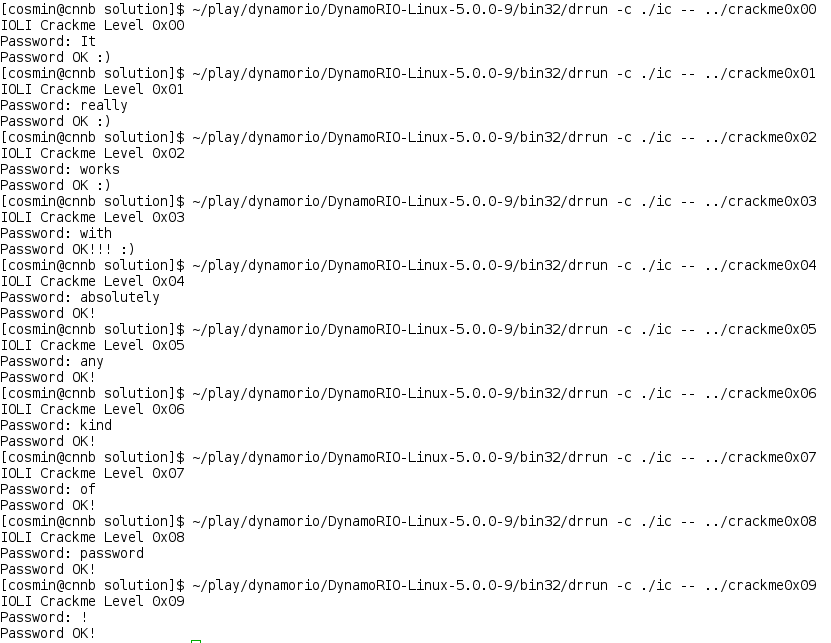

Solving IOLI-crackme with Dynamic Binary Modification and GDB
=============================================================

I don't commonly see Dynamic Binary Modification (DBM) being used for reverse engineering and binary patching, which is a shame since it's quite a good tool for this sort of thing. Compared to regular binary patching, it has the advantage that the executable remains unmodified on disk and appears unmodified in memory at runtime. 

Note that the use of a DBM tool can be detected if the application is specifically designed to do it.


Prerequisites
-------------

* to understand the guide:
  * understanding of assembly programming
  * minimal understanding of X86 assembly language and ABI
  
* to follow the guide and run the software:
  * a GNU/Linux system
  * [IOLI-crackme](http://pof.eslack.org/tmp/IOLI-crackme.tar.gz)
  * [DynamoRIO](https://code.google.com/p/dynamorio/wiki/Downloads)
  * [GDB](http://www.gnu.org/software/gdb/)
  

Goal
----

The goal is to apply the minimal changes to each of the executables to make them accept any password. *The minimal changes* considers both changes in execution flow and in terms of number of modified instructions, for example it wouldn't be acceptable to essentially rewrite the executable or to insert branch instructions that bypass all code between asking for a password and printing that the password is correct.


Approach
--------

We're going to use GDB to reverse engineer the control flow and then write a DynamoRIO plugin which detects which crackme is running and dynamically patches it to accept any password. Let's start with a skeleton DynamoRIO client which detects which crackme is running based on filename and iterates over each instruction ahead of execution:

```c
#include "dr_api.h"
#include "utils.h"

unsigned int crackme_version;

static dr_emit_flags_t event_basic_block(void *drcontext, void *tag, instrlist_t *bb,
                                         bool for_trace, bool translating) {
                                         
  instr_t *instr;
  for (instr = instrlist_first_app(bb); instr != NULL; instr = instr_get_next_app(instr)) {
    switch(crackme_version) {
      <patching logic goes here>
    }
  }
  
  return DR_EMIT_DEFAULT;
}

DR_EXPORT void dr_init(client_id_t id) {
  int ret;

  ret = dr_sscanf(dr_get_application_name(), "crackme0x%u", &crackme_version);
  if (ret != 1 || crackme_version > 9) {
    dr_printf("Unknown application, exiting\n");
    dr_exit_process(EXIT_FAILURE);
  }
  
  dr_register_bb_event(event_basic_block);
}
```

The `dr_init()` function is called when DynamoRIO initializes. It checks if the filename matches the known pattern and then it registers a callback for basic block creation. The `event_basic_block()` function will then be called by DynamoRIO every time it builds a new basic block, allowing our client to inspect and modify the instruction stream by iterating over the instruction list `instrlist_t *bb`.


Level 0x00
----------

We use GDB to dissasemble the *main* function:

    (gdb) disas main
    
    Dump of assembler code for function main:
    0x08048414 <+0>:	push   %ebp
    0x08048415 <+1>:	mov    %esp,%ebp
    0x08048417 <+3>:	sub    $0x28,%esp
    0x0804841a <+6>:	and    $0xfffffff0,%esp
    0x0804841d <+9>:	mov    $0x0,%eax
    0x08048422 <+14>:	add    $0xf,%eax
    0x08048425 <+17>:	add    $0xf,%eax
    0x08048428 <+20>:	shr    $0x4,%eax
    0x0804842b <+23>:	shl    $0x4,%eax
    0x0804842e <+26>:	sub    %eax,%esp
    0x08048430 <+28>:	movl   $0x8048568,(%esp)
    0x08048437 <+35>:	call   0x8048340 <printf@plt>
    0x0804843c <+40>:	movl   $0x8048581,(%esp)
    0x08048443 <+47>:	call   0x8048340 <printf@plt>
    0x08048448 <+52>:	lea    -0x18(%ebp),%eax
    0x0804844b <+55>:	mov    %eax,0x4(%esp)
    0x0804844f <+59>:	movl   $0x804858c,(%esp)
    0x08048456 <+66>:	call   0x8048330 <scanf@plt>
    0x0804845b <+71>:	lea    -0x18(%ebp),%eax
    0x0804845e <+74>:	movl   $0x804858f,0x4(%esp)
    0x08048466 <+82>:	mov    %eax,(%esp)
    0x08048469 <+85>:	call   0x8048350 <strcmp@plt>
    0x0804846e <+90>:	test   %eax,%eax
    0x08048470 <+92>:	je     0x8048480 <main+108>
    0x08048472 <+94>:	movl   $0x8048596,(%esp)
    0x08048479 <+101>:	call   0x8048340 <printf@plt>
    0x0804847e <+106>:	jmp    0x804848c <main+120>
    0x08048480 <+108>:	movl   $0x80485a9,(%esp)
    0x08048487 <+115>:	call   0x8048340 <printf@plt>
    0x0804848c <+120>:	mov    $0x0,%eax
    0x08048491 <+125>:	leave
    0x08048492 <+126>:	ret

The structure of this first example should be quite obvious:
* `printf()` is called twice to print *IOLI Crackme Level 0x00* (`0x08048437`) and *Password:* (`0x08048443`);
* after which text is read from stdin with scanf (`0x08048456`);
* the input is compared against the password with strcmp (`0x08048469`);
* and depending on the result either a success (`0x08048480`) or failure(`0x08048479`) message is printed out

The parameters passed to printf can be inspected with *x/s*, e.g.

```
(gdb) x/s 0x80485a9
0x80485a9:	"Password OK :)\n"
```

The conditional branch instruction which determines which message gets printed is at `0x08048470`: `JE 0x8048480` and it is taken when the return value of strcmp is 0. Since we want to always print the success message, we'll modify it to execute unconditionally by inserting the following code in the `event_basic_block` switch statement:

```c
case 0:
  if (instr_get_app_pc(instr) == (app_pc)0x08048470) {
   instr_set_opcode(instr, OP_jmp);
  }
  break;
```

Where `instr_get_app_pc()` returns the address of an `instr_t instruction` and `instr_set_opcode()` changes the opcode decoded from the application to one of our choosing, in this case `JMP` for an unconditional jump.


Level 0x01
----------

This is very similar to the previous level:

```
(gdb) disas main

Dump of assembler code for function main:
[...]
0x0804841b <+55>:	mov    %eax,0x4(%esp)
0x0804841f <+59>:	movl   $0x804854c,(%esp)
0x08048426 <+66>:	call   0x804830c <scanf@plt>
0x0804842b <+71>:	cmpl   $0x149a,-0x4(%ebp)
0x08048432 <+78>:	je     0x8048442 <main+94>
```

The major difference being that there is no call to strcmp. To understand what is going on, we can set a breakpoint right before `scanf()` is called and inspect its parameters:

```
(gdb) b *0x08048426
(gdb) run
(gdb) x/4xw $esp
0xffffd5b0:	0x0804854c	0xffffd5d4	0x00000000	0xf7e06dcb
(gdb) x/s 0x0804854c
0x804854c:	"%d"
(gdb) print/x $ebp
$1 = 0xffffd5d8

```

So `scanf()` is called as `scanf("%d", [$ebp-4])`, and the number saved in `[$ebp-4]` by `scanf()` is compared against `0x149a` (which is the correct password once converted to base-10). The patching strategy is identical with that for level 0x00, with `JE` being replaced with a `JMP`.

Level 0x02
----------

Once again, this level is relatively similar to the previous one:

```
(gdb) disas main

Dump of assembler code for function main:
[...]
   0x0804842b <+71>:	movl   $0x5a,-0x8(%ebp)
   0x08048432 <+78>:	movl   $0x1ec,-0xc(%ebp)
   0x08048439 <+85>:	mov    -0xc(%ebp),%edx
   0x0804843c <+88>:	lea    -0x8(%ebp),%eax
   0x0804843f <+91>:	add    %edx,(%eax)
   0x08048441 <+93>:	mov    -0x8(%ebp),%eax
   0x08048444 <+96>:	imul   -0x8(%ebp),%eax
   0x08048448 <+100>:	mov    %eax,-0xc(%ebp)
   0x0804844b <+103>:	mov    -0x4(%ebp),%eax
   0x0804844e <+106>:	cmp    -0xc(%ebp),%eax
   0x08048451 <+109>:	jne    0x8048461 <main+125>
[...]
```

In this case the conditional branch is taken when the entered password is wrong. To accept any password, we can either replace the conditional branch instruction with a `NOP` or we can change its target to be the following instruction. I have chosen the latter approach:

```c
case 2:
  if (instr_get_app_pc(instr) == (app_pc)0x08048451) {
    instr_set_branch_target_pc(instr, (app_pc)0x08048453);
  }
  break;
```

To find the correct password, there's no need to fully understand how it is generated. We can simply set a breakpoint before the `CMP` instruction and inspect the computed value:

```
(gdb) b *0x0804844e
(gdb) run
<enter a random password>
Breakpoint 1, 0x0804844e in main ()
(gdb) x/dw $ebp - 0xc
0xffffd5cc:	338724
```

So the correct password is 338724.


Level 0x03
----------

Level 0x03 finally uses more than one function. By using the procedure described for Level 0x01, we can trace its execution:

```
main()
  printf(...)
  printf(...)
  scanf("%d", 0xffffd5d4)
  test(input_int, 0x00052b24)
    [..]
    0x08048477 <+9>:	cmp    0xc(%ebp),%eax       // cmp 0x00052b24, input_int
    0x0804847a <+12>:	je     0x804848a <test+28>
    0x0804847c <+14>:	movl   $0x80485ec,(%esp)
    0x08048483 <+21>:	call   0x8048414 <shift>    // shift(0x80485ec)
    0x08048488 <+26>:	jmp    0x8048496 <test+40>
    0x0804848a <+28>:	movl   $0x80485fe,(%esp)
    0x08048491 <+35>:	call   0x8048414 <shift>    // shift(0x80485fe)
```

`shift()` takes a single parameter and the value of that parameter can only take 2 possible values, depending on the result of the comparison between `0x52b24` and the input password. We can patch this level in the same way as levels 0x00 and 0x01.


Level 0x04
----------

```
main()
  check(input_string)
    [...]
    0x0804848a <+6>:	movl   $0x0,-0x8(%ebp)
    0x08048491 <+13>:	movl   $0x0,-0xc(%ebp)
    0x08048498 <+20>:	mov    0x8(%ebp),%eax
    0x0804849b <+23>:	mov    %eax,(%esp)
    0x0804849e <+26>:	call   0x8048384 <strlen@plt>
    0x080484a3 <+31>:	cmp    %eax,-0xc(%ebp)
    0x080484a6 <+34>:	jae    0x80484fb <check+119>
    0x080484a8 <+36>:	mov    -0xc(%ebp),%eax
    0x080484ab <+39>:	add    0x8(%ebp),%eax
    0x080484ae <+42>:	movzbl (%eax),%eax
    0x080484b1 <+45>:	mov    %al,-0xd(%ebp)
    0x080484b4 <+48>:	lea    -0x4(%ebp),%eax
    0x080484b7 <+51>:	mov    %eax,0x8(%esp)
    0x080484bb <+55>:	movl   $0x8048638,0x4(%esp)
    0x080484c3 <+63>:	lea    -0xd(%ebp),%eax
    0x080484c6 <+66>:	mov    %eax,(%esp)
    0x080484c9 <+69>:	call   0x80483a4 <sscanf@plt>  // 
    0x080484ce <+74>:	mov    -0x4(%ebp),%edx
    0x080484d1 <+77>:	lea    -0x8(%ebp),%eax
    0x080484d4 <+80>:	add    %edx,(%eax)
    0x080484d6 <+82>:	cmpl   $0xf,-0x8(%ebp)
    0x080484da <+86>:	jne    0x80484f4 <check+112>
    0x080484dc <+88>:	movl   $0x804863b,(%esp)
    0x080484e3 <+95>:	call   0x8048394 <printf@plt>
    0x080484e8 <+100>:	movl   $0x0,(%esp)
    0x080484ef <+107>:	call   0x80483b4 <exit@plt>
    0x080484f4 <+112>:	lea    -0xc(%ebp),%eax
    0x080484f7 <+115>:	incl   (%eax)
    0x080484f9 <+117>:	jmp    0x8048498 <check+20>
    0x080484fb <+119>:	movl   $0x8048649,(%esp)
    0x08048502 <+126>:	call   0x8048394 <printf@plt>
    0x08048507 <+131>:	leave
    0x08048508 <+132>:	ret
```

The loop (from `0x08048498` to `0x080484f9`) iterates through the characters of the string until its end (the iterator's value in `[$ebp-0xC]` is equal to `strlen(input_string)` (`0x080484a6`)) or until the sum of all digits `[$ebp-8]` (`0x080484d4`) is equal to 0xF (`0x080484d6`). `sscanf()` is used to get the value of each digit in `[$ebp-4]` (`0x080484c9`).

This function can be patched to accept any password by changing the target of the conditional jump at address `0x080484da` to `0x080484dc`:

```c
case 4:
  if (instr_get_app_pc(instr) == (app_pc)0x080484da) {
    instr_set_branch_target_pc(instr, (app_pc)0x080484dc);
  }
  break;
```


Level 0x05
----------

```
   [...]
   0x0804851a <+82>:	cmpl   $0x10,-0x8(%ebp)
   0x0804851e <+86>:	jne    0x804852b <check+99>
   0x08048520 <+88>:	mov    0x8(%ebp),%eax
   0x08048523 <+91>:	mov    %eax,(%esp)
   0x08048526 <+94>:	call   0x8048484 <parell>
   [...]
```

Level 0x05 works similarly to level 4, with the values of each digit being added together. Instead of 15, the matching sum is 16. If the sum is 16, another function -`parell()`- gets called with the input string being its only parameters, i.e. `parell(input string);`:

```
   [...]
   0x0804848a <+6>:	lea    -0x4(%ebp),%eax
   0x0804848d <+9>:	mov    %eax,0x8(%esp)
   0x08048491 <+13>:	movl   $0x8048668,0x4(%esp)
   0x08048499 <+21>:	mov    0x8(%ebp),%eax
   0x0804849c <+24>:	mov    %eax,(%esp)
   0x0804849f <+27>:	call   0x80483a4 <sscanf@plt>
   0x080484a4 <+32>:	mov    -0x4(%ebp),%eax
   0x080484a7 <+35>:	and    $0x1,%eax
   0x080484aa <+38>:	test   %eax,%eax
   0x080484ac <+40>:	jne    0x80484c6 <parell+66>
   [...]
```

`parell()` calls `sscanf(input_string, "%d", [$EBP-4])`. The following instructions (`0x080484a4` to `0x080484ac`) test the least significant bit of the number, with even numbers being accepted.

This level needs two patches: one to accept any sum of digits and one to accept both odd and even numbers:

```c
case 5:
  switch((unsigned int)instr_get_app_pc(instr)) {
    case 0x0804851e:
      instr_set_branch_target_pc(instr, (app_pc)0x08048520);
      break;
    case 0x080484ac:
      instr_set_branch_target_pc(instr, (app_pc)0x080484ae);
      break;
  }
  break;
```


Level 0x06
----------

Level 0x06 is similar to Level 0x05, but it adds an aditional check: an environment variable with a name starting with `LOL` has to be defined. `main()`, `check()`, and `parell()` pass the environment `(char **)` parameter to `dummy(char **envp)`.

```
(gdb) disas dummy
   [...]
   0x080484e6 <+50>:	movl   $0x3,0x8(%esp)
   0x080484ee <+58>:	movl   $0x8048738,0x4(%esp)
   0x080484f6 <+66>:	mov    (%ecx,%edx,1),%eax
   0x080484f9 <+69>:	mov    %eax,(%esp)
   0x080484fc <+72>:	call   0x80483d8 <strncmp@plt>
   0x08048501 <+77>:	test   %eax,%eax
   0x08048503 <+79>:	jne    0x80484c1 <dummy+13>
   0x08048505 <+81>:	movl   $0x1,-0x8(%ebp)
   0x0804850c <+88>:	jmp    0x8048515 <dummy+97>
   0x0804850e <+90>:	movl   $0x0,-0x8(%ebp)
   0x08048515 <+97>:	mov    -0x8(%ebp),%eax
   0x08048518 <+100>:	leave  
   0x08048519 <+101>:	ret    
```

`dummy()` works by iterating over every environment variable string and using `strncmp(var, "LOLO", 3)` to try to match each one. If a match is found, `dummy()` returns 1, otherwise it returns 0 is there is no match. The check in `dummy()` can be bypassed by patching the conditional jump at `0x08048503`:

```c
  switch((unsigned int)instr_get_app_pc(instr)) {
    case 0x08048503:
      instr_set_branch_target_pc(instr, (app_pc)0x08048505);
      break;
```

Since this level also does the same checks as level 0x05, we have to apply the other two patches:

```c
     case 0x08048565:
       instr_set_branch_target_pc(instr, (app_pc)0x08048567);  // bypass LSB check
       break;
     case 0x080485de:
       instr_set_branch_target_pc(instr, (app_pc)0x080485e0); // bypass sum == 16 check
       break;
  }
```

Level 0x07
----------

The ELF binary for level 0x07 doesn't have any symbols, so it wouldn't be possible to use the `disas` GDB command as before. Probably the easiest way to break execution in a good place is to run it and interrupt when it asks for a password:

```
(gdb) run
IOLI Crackme Level 0x07
Password: ^C
Program received signal SIGINT, Interrupt.
[...]
(gdb) backtrace
#0  0xf7fd7da0 in ?? ()
#1  0xf7e475c7 in __GI__IO_default_uflow () from /usr/lib32/libc.so.6
#2  0xf7e473dc in __uflow () from /usr/lib32/libc.so.6
#3  0xf7e2829f in __GI__IO_vfscanf () from /usr/lib32/libc.so.6
#4  0xf7e37bd7 in scanf () from /usr/lib32/libc.so.6
#5  0x080486c7 in ?? ()
#6  0xf7defe5e in __libc_start_main () from /usr/lib32/libc.so.6
#7  0x08048421 in ?? ()
```

From the backtrace we can find the place where `main()` calls `scanf()` for password input: `0x80486c2`. We can then use the `x/ni` GDB command to look at the code, where `x` stands for examine, `n` is a positive integer for how many items to show and `i` stands for instructions, as in decode memory contents as instructions:

```
(gdb) x/10i 0x080486c2
   0x80486c2:	call   0x8048398 <scanf@plt>
   0x80486c7:	mov    0x10(%ebp),%eax
   0x80486ca:	mov    %eax,0x4(%esp)
   0x80486ce:	lea    -0x78(%ebp),%eax
   0x80486d1:	mov    %eax,(%esp)
   0x80486d4:	call   0x80485b9
   0x80486d9:	mov    $0x0,%eax
   0x80486de:	leave  
   0x80486df:	ret    
   [...]
```

After setting a breakpoint at `0x80486d4` we can see that the function at `0x80485b9` is called as `0x80485b9(input_string, envp)`. It can be inspected with `x/ni` and it should be obvious that it is similar to the `check()` function of level 0x06. The sum-of-digits-check is at address `0x804860b` and we can see that in case of a match it calls another function at address `0x8048542`.

The function at address `0x8048524` (`parell()`) does the LSB check at address `0x8048588` and it calls `0x80484b4` (`dummy()`), which checks if the `LOL*` environment variable is defined.

Level 0x07 is patched exactly the same as Level 0x06, but at different locations:

```c
case 0x07:
  switch((unsigned int)instr_get_app_pc(instr)) {
    case 0x08048503:
      instr_set_branch_target_pc(instr, (app_pc)0x08048505);
      break;
    case 0x804858d:
      instr_set_branch_target_pc(instr, (app_pc)0x804858f);
      break;
    case 0x804860f:
      instr_set_branch_target_pc(instr, (app_pc)0x8048611);
      break;
  }
  break;
```


Level 0x08
----------

This is identical to Level 0x07, except that the ELF file contains symbols. The patches are identical, at the same locations.


Level 0x09
----------

The ELF file for level 0x09 doesn't contain symbols. It accepts passwords in exactly the same conditions as Levels 6, 7 and 8, but with a slightly different implementation. The solution is included, but reverse engineering it will be left as an exercise for the reader.


Building the DynamoRIO client
-----------------------------

    DRIO=<PATH TO DYNAMORIO FOLDER> make
    
Running it
----------

    <PATH TO DYNAMORIO FOLDER>/bin32/drrun -c ./ic -- <PATH TO IOLI-CRACKME>/crackme0x0X
    
Demo
----



License
-------

This document is licensed under a [Creative Commons Attribution-ShareAlike 4.0 International License](http://creativecommons.org/licenses/by-sa/4.0/). The full code is separately licensed under the [BSD 2-Clause License](http://opensource.org/licenses/BSD-2-Clause).

